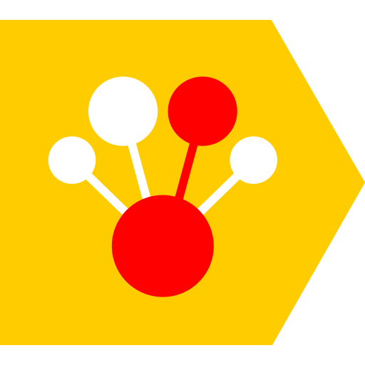

# Please be patient, I ~~don't~~ have sense of humor
My name is Evgeny Plyushch (_cyrillic: Евгений Плющ_)  
This is my GitHub profile.  
Education/Career/Achievements can be found [here in CV](https://drive.google.com/file/d/1oY-DEJxrwSMvIJPyxY0dVUbGOgz5xsDF/view)

### Contacts:
I speak **English** (fluent, I guess) & **Russian** (native)

**Telegram:** [link](https://t.me/Zhekuson)  
**Email:**  zhekuson@gmail.com    
**Kaggle profile:** [link](https://www.kaggle.com/zhekuson)

---
## Key points
### Preferable position
DS / MLE / MLR  
Current occupation: Moscow, Russia  
Remote/relocate is possible
### Skills

---

---

**Primary language:** Python

[//]: # (**Familiar:**  Golang)

[//]: # (**Frameworks/Technologies:**)

[//]: # ()
[//]: # (**_ML:_**)

[//]: # ()
[//]: # (![Pytorch]&#40;https://img.shields.io/badge/Pytorch-fa3812&#41; )

[//]: # (![Catboost]&#40;https://img.shields.io/badge/Catboost-fccb00&#41;)

[//]: # (![Optuna]&#40;https://img.shields.io/badge/Optuna-0a2c75&#41; )

[//]: # (![Wandb]&#40;https://img.shields.io/badge/Wandb-191c1e&#41;)

[//]: # ()
[//]: # (_**DE/ETL:**_ )

[//]: # ()
[//]: # (![PySpark]&#40;https://img.shields.io/badge/PySpark-f44f00&#41; )

[//]: # (![Hadoop]&#40;https://img.shields.io/badge/Hadoop-efeb03&#41; )

[//]: # (![Clickhouse]&#40;https://img.shields.io/badge/Clickhouse-fccb00&#41;)

[//]: # (![Kafka]&#40;https://img.shields.io/badge/Kafka-ffffff&#41; )

[//]: # (![Airflow]&#40;https://img.shields.io/badge/Airflow-35e5f1&#41; )

[//]: # ()
[//]: # (**_Utilities/other:_**)

[//]: # ()
[//]: # (![Docker]&#40;https://img.shields.io/badge/Docker-2060f6&#41; ![Grafana]&#40;https://img.shields.io/badge/Grafana-fb7a00&#41;)

[//]: # (![Git]&#40;https://img.shields.io/badge/Git-fa401e&#41; ![Bash]&#40;https://img.shields.io/badge/Bash-22b643&#41; ![Latex]&#40;https://img.shields.io/badge/Latex-010101&#41;  )

## Some repos 

    
	

---

[//]: # (## Education)

[//]: # ()
[//]: # (| Level             | Place of study                              | Field of study                                                                        | Timeline  |)

[//]: # (|-------------------|---------------------------------------------|---------------------------------------------------------------------------------------|-----------|)

[//]: # (| Master's degree   | HSE University, Faculty of Computer Science | Applied Mathematics and Informatics &#40;Machine Learning and Data‐Intensive Systems&#41; | 2022-2024 |)

[//]: # (| Bachelor's degree | HSE University, Faculty of Computer Science | Software Engineering                                                                  | 2018-2022 |)

[//]: # (| High School       | Lyceum №1580 at the MSTU                    | General education, in-depth Physics and Mathematics                                   | 2015-2018 |)

[//]: # ()
[//]: # (_"I used to be a developer like you. Then I took an arrow in the knee"_)

[//]: # ()
